# 1.Stream流的操作

Java8中有两个最为重要的改变,第一个是Lambda表达式；另外一个则是Stream  API,Stream 是Java8中处理集合的关键抽象概念,它可以指定你i希望对集合进行的操作,可以执行非常复杂的查找,过滤,和映射数据等操作使用Stream Api对集合数据进行操作,就类似于使用SQL执行的数据库查询,也可以使用Stream ApI来执行擦欧总,简而言之,Stream API提供了一种高效且易于使用的处理数据的方式


在对数据源(集合，数组等)进行数据的传输时，先将数据源转换成一个流可以对数据源进行一系列的中间操作,比如过滤，进行中间操作后对原来的数据源是不会改变的,进行中间的操作之后,会产生一个新的流

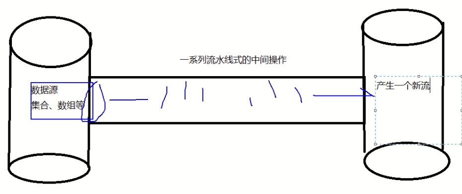

# 2.什么是Stream

流是什么?

是数据渠道,用于操作数据源(集合,数组)所生成的元素序列"集合讲的是数据,流讲的是计算"


注意:

1. Stream自己不会存储元素
2. Stream不会改变源对象,相反,它们会返回一个持有结果的Stream
3. Stream操作时延迟执行的,这意味着他们会等到需要结果的时候才执行

# xxxxxxxxxx //java8并行流实现1到10000L的累加,使用parallel方法转变为并行流LongStream.range(0,100000L).parallel().reduce(0,Long::sum);java

1. 创建Stream

   一个数据源(如:集合,数组),获取一个流

2. 中间操作

   一个中间操作链,对数据源的数据进行处理

3. 终止操作(终端操作)

   一个终止操作,执行中间操作链，并产生结果

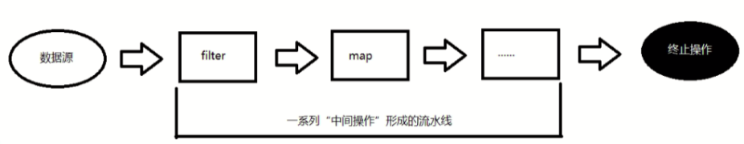

# 4.创建Stream流

```java

        //一.创建Stream
              //1.可以通过Collection系列集合提供的stream()方法或parallelStream()方法
                List<String> list=new ArrayList<>();
                Stream<String> stream1=list.stream();//将集合转换为流
             //2.通过Arrays中的静态方法stream()获取数组流
                String [] arr=new String[10];
                Stream<String> stream2 = Arrays.stream(arr);//将数组转换为流
            //3.通过Stream类中的静态方法0f,参数可以传入一个数组
                Stream<String> stream3 = Stream.of("aa", "bb", "cc");
            //4.创建无限流
               //创建无限流方式1
                Stream<Integer> stream4 = Stream.iterate(0, (x) -> x + 2);//迭代，第一个参数时起始值，第二个参数是终止值
                stream4.forEach(System.out::println);
                //如果只需要无限流的前10个Stream流
                stream4.limit(10).forEach(System.out::println);
               //创建无限流的方式2
      Stream.generate(() -> Math.random()).limit(10).forEach(System.out::println);
```

# 5.中间操作和终止操作+

多个中间操作可以连接起来形成一个流水线，除非流水线上出触发终止操作,否则中间操作不会执行任何的处理，而在终止操作时一次性全部处理,称为"惰性求值"和延迟加载，中间操作不会执行任何操作,只有当终止操作时才会全部执行

## 1.刷选与切片

1. filter:接收Lambda,从流中排除某些元素
2. limit:截断流，使其元素不超过给定的数量
3. skip(n):跳过元素，返回一个扔掉前n个元素的流,若流中元素不足n个,则返回一个空流，与limit(n)互补
4. disinct：帅选，通过流所生成元素的hashCode()和equals()去除重复元素

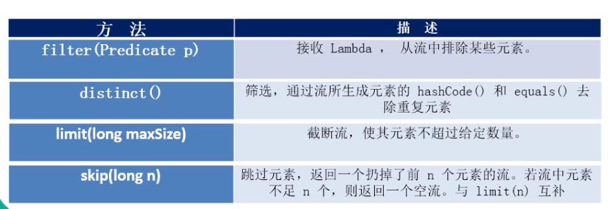

以filter和limit为例

```java
 //二.中间操作
           //1.帅选与切片
              //filter,参数是断言式接口的Lambda作为参数
              stream3.filter((x)->x=="aa").limit(3);
              /*
              终止操作:一次性执行全部的内容，即“惰性求值"
              这里是内部迭代,迭代操作由Stream API完成
               */
              stream3.forEach(System.out::println);
```

## 2.映射

1. map:接收Lambda,将元素转换成其他的形式或提取信息，接收一个函数作为参数，该函数会被应用到每个元素上,并将其映射成一个新的元素
2. flatMap:接收作为参数,将流中的每个值都转换为另一个流，然后把所有的流连接成一个流

```
 //将字符串所有的都转换为大写，map可以将每个元素应用在Lambda的函数上，也就是集合或者数组中的每个元素都进行Lambda中的函数式的应用，map得到的是一个新的Stream流
              stream3.map((s)->s.toUpperCase());
                        //flatmap将数组或者集合中的元素经过Lambda函数的操作后连接成为一个新的流
     stream3.flatMap(utils::addstr);
```

## 3.排序

sorted():自然排序

sorted(Comparator com):定制排序

定制排序的举例

```java
     stream3.sorted((e1,e2)->{
         if(e1.getAge()<e2.getAge()){
             return  e1;
         }else{
             return  e2;
         }
     });
```

# 4.终止操作

##    1.查找与匹配

查找与匹配返回的是true或者fasle,所以以下的方法的参数都是断言式接口

1.  allMatch:检查是否匹配所有的元素，参数为断言式接口

2. anyMatch:检查是否至少匹配一个元素

3. noneMatch:检查是否没有匹配所有的元素

4. findFirst:返回第一个元素

5. findAny:返回当前流中的任意元素

6. count:返回流中元素的总个数

7. max:返回流中最大值

8. min:返回流中最小值

   以allMatch检查是否匹配所有的元素

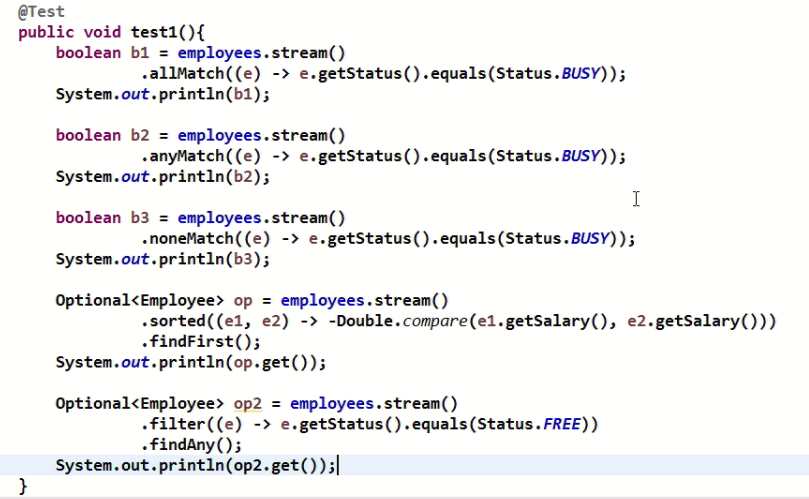

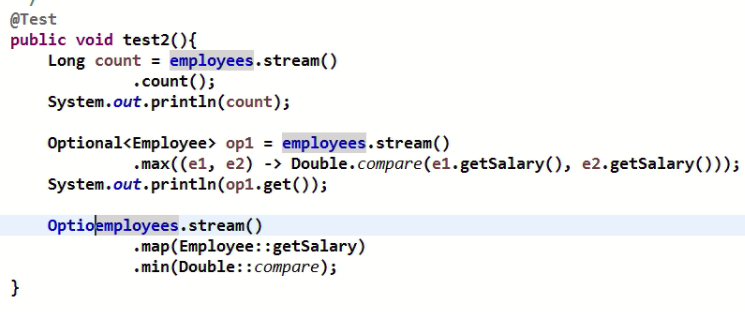

## 2.归约

reduce(T  identity,BinaryOperator)：可以将流中的元素反复结合起来,得到一个值T

reduce(BinaryOperator)：可以将流中的元素反复结合起来，得到一个值，返回Optional<T>

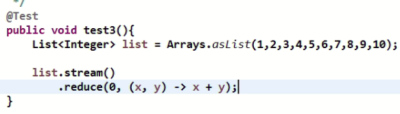

、

map和reduce的连接通常称为map-reduce模式，因Google用它来进行网络搜索而出名

## 3.收集

collect:将流转换为其他形式，接收一个Collector接口的实现，用于Stream中的元素做汇总的方法

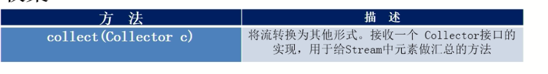

COllector接口中的方法的实现决定了如何对流执行收集操作(如收集到List,Set,Map)但是，Collectors实用类提供了很多静态方法，可以方便地创建常见收集实例，具体方法与实例如下表

collect中的参数是Collector中的方法作为收集方式

如下:

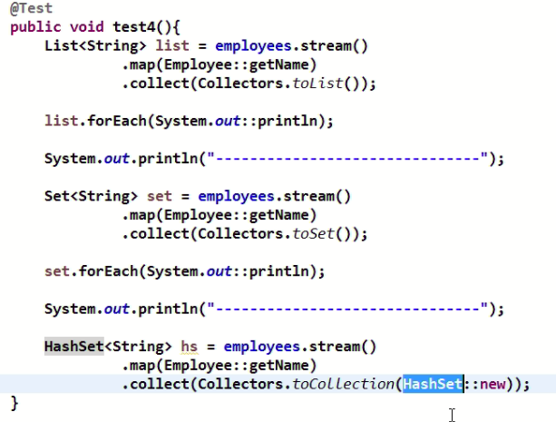

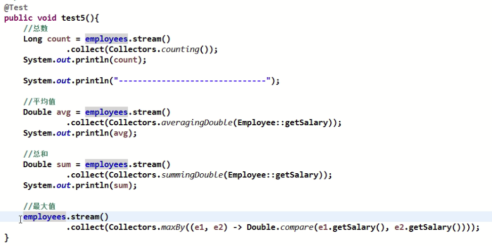

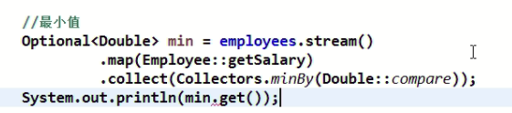

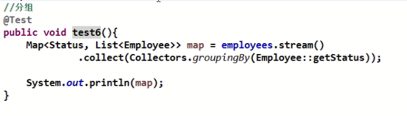

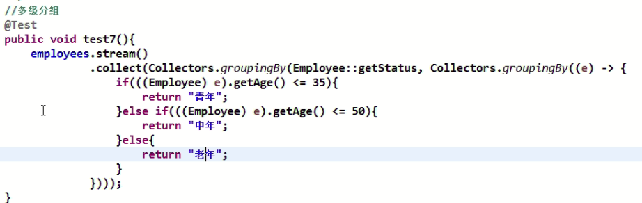

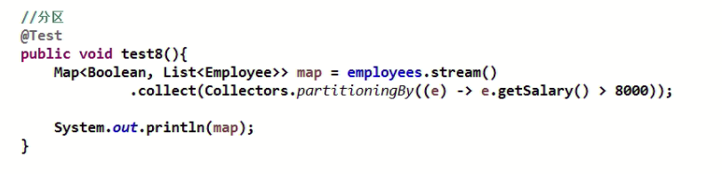

# 5.Stream流的使用

给定一个数字列表，如何返回一个由每个数的平方构成的列表呢？给定{1,2,3,4,5}应该返回[1,4,,9,16,25]

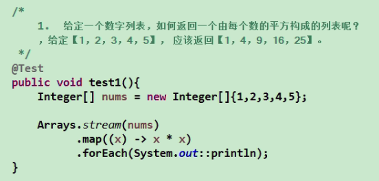

用map和reduce方法数一数流中有多少个对象

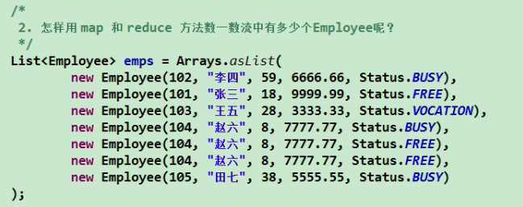