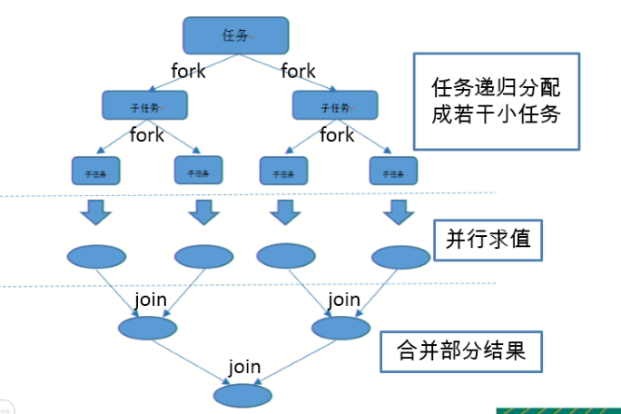
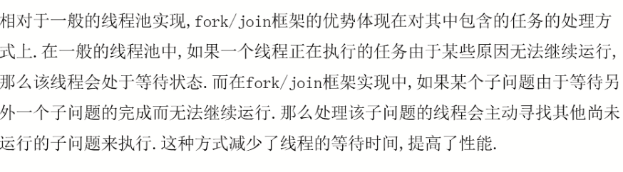

# 1.并行流

并行流就是把一个内容分为多个数据块,并用不同的线程分别处理每个数据块的流

Java8中将并行进行优化,我们可以很容易对数据进行并行的操作,Stream API可以声明性的通过parellel()与sequetial()在并行流与顺序流之间进行切换

# 2.传统线程存在的问题

当某一个线程发生阻塞时,该线程的任务处于忙碌的状态,其他的分支线程如果正常执行,无法与进行堵塞状态线程的执行结果进行合并，严重影响效率

# 3.Fork/join

就是在必要的情况下,将一个大任务，进行拆分成若干个小任务(拆分到不可再拆时),再将一个个小任务运算的结果进行join汇总d



# 4.Fork/Join框架和传统线程池的区别

采用"工作窃取"模式

当执行新的任务时可以将其拆分成分更小的任务执行，并将小任务加到线程队列中，然后再从一个随机线程的队列偷一个并把它放在自己的队列中



也就是当某个分支线程执行出现问题时,其他已经执行完成的分支线程会从出现问题的线程获取要执行的任务，帮助出现问题的线程完成执行


## 5.使用Fork/Join框架进行计算1- 10000L

```java
public class hellotest  extends RecursiveTask<Long> {


  //序列化
  private static final long serialVersionUID = 1L;
  //拆分的起始位置
  private long start;
  //拆分的结束位置
  private long end;
  public  hellotest(long start,long end){
    this.start=start;
    this.end=end;
  }

  private  static  final  long THRESHOLD = 10000;
  long sum;
    @Override
    protected Long compute() {
        long length = end - start;//获取长度
        if (length <= THRESHOLD) {
            sum = 0;
            for (long i = start; i <= end; i++) {
                sum += i;
            }
            //继续对半拆分，将中间值赋值给结束值，继续进行执行
        }else {
            long middle = (start + end) / 2;
            //拆分的一部分，上半部分
            hellotest left = new hellotest(start, middle);
            left.fork();//拆分子任务，同时压入线程队列
            //拆分的一部分，下半部分
            hellotest right = new hellotest(middle + 1, end);
            right.fork();//拆分子任务，同时压入线程队列
        }
        return sum;
    }

    public static void main(String[] args) {
        Instant start = Instant.now();//开始时间
       //线程池的支持
        ForkJoinPool pool = new ForkJoinPool();
        //给需要进行操作的起始位置和终止位置赋值
        hellotest task = new hellotest(1, 10000);
        //执行任务,对分支执行的结果进行合并
        Long result = pool.invoke(task);
        System.out.println(result);
        //结束时间
        Instant end = Instant.now();
        //获取程序的执行时间
        System.out.println("耗时：" + (end.toEpochMilli() - start.toEpochMilli()) + "毫秒");
    }
}
```

因为拆分合并也是需要时间来执行的,所以，fork/join使用于范围比较大的操作

# 6.使用并行流进行1到100000L的累加

```java
//java8并行流实现1到10000L的累加,使用parallel方法转变为并行流
LongStream.range(0,100000L).parallel().reduce(0,Long::sum);
```